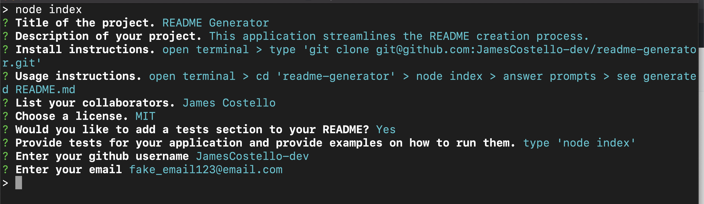

# CMS Employee Tracker

## Description

CMS command line application that tracks employee data and writes to mysql.

## Table of Contents

* [Installation](#installation)
* [Usage](#usage)
* [Credits](#credits)
* [License](#license)

## Installation

[git, express, inquirer, mysql2, mysql, nodemon, cTable]

## Usage

'scripts': {'start': 'nodemon server.js'},

## Credits

JamesCostello-Dev

## License 

## Tests

undefined

## Questions

[Github Profile](https://github.com/JamesCostello-dev)

Have a question?  Send an fake_email@email.com.
